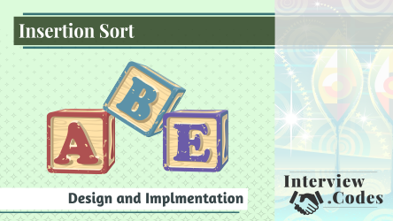

This is an implementation of insertion sort in Python. It's the example for the 
[SkillShare class on Insertion Sort](https://edaqa.link/InsertionSort-GH).

*Learn this simple sorting algorithm.*

Insertion sort is a commonly taught algorithm, and some interviewers like to ask about it. As you'll see in this class, it's an easy algorithm to understand and implement. You'll learn the algorithmic complexity and understand why the algorithm is rarely used.

