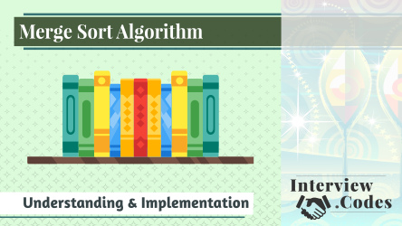

This is an implementation of merge search in Python. It's the example for the 
[SkillShare class on Merge Sort](https://edaqa.link/MergeSort-GH).

**Master the classic programming sorting algorithm.**

Sorting is a key activity in programming, and you should understand how it works. Merge sort is a common approach. By learning this algorithm, you’ll improve your understanding of sorting. It serves as a cornerstone to your algorithmic knowledge, helping you in your job, and improving your interview performance.

In this class, we’ll look at:

- How the merge sort algorithm works
- The time and space complexity
- An implementation coded in Python
